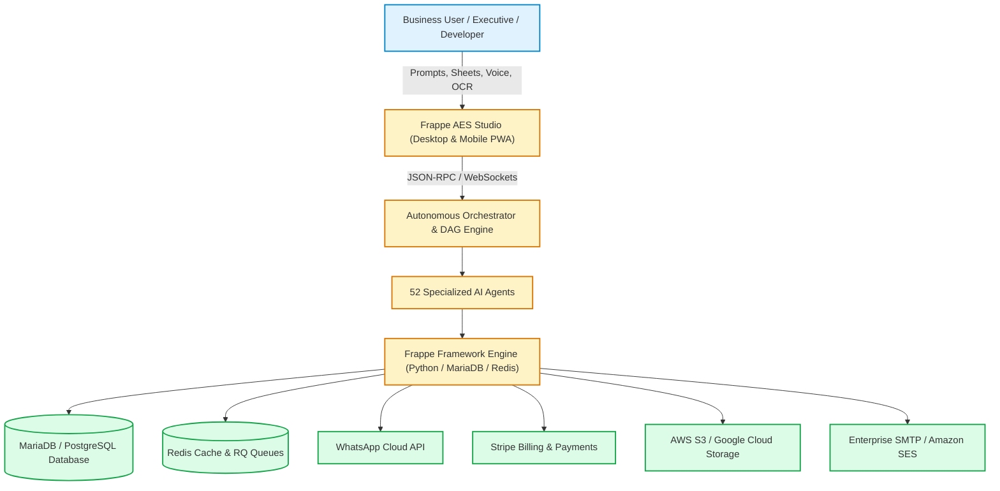
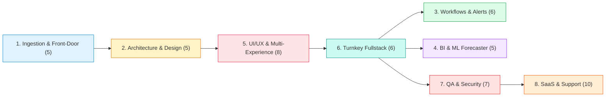

# 🏗️ High-Level Design (HLD): Frappe Autonomous Enterprise Studio (Frappe AES)
## Enterprise Multi-Agent System Architecture & Infrastructure Topology
### Version 2.0.0 | Enterprise Edition

---

## 1. Executive System Context & Objectives

**Frappe Autonomous Enterprise Studio (Frappe AES)** is a distributed, multi-agent autonomous engineering platform designed to turn high-level business requirements into fully functional, production-ready enterprise applications on the Frappe Framework and ERPNext runtime.

### Key Architectural Objectives
1. **Zero-Code Accessibility**: Enable non-technical stakeholders to build ERP applications via natural language, spreadsheets, voice, or scanned documents.
2. **Deterministic Agent Coordination**: Orchestrate 52 specialized AI agents across a Directed Acyclic Graph (DAG) with automated verification gates.
3. **Institutional Security & Governance**: Enforce strict Segregation of Duties (SoD), AST-based static security checks (Frappe Shield), and GDPR data privacy.
4. **Cloud & Air-Gapped Portability**: Run on standard Linux/Docker environments with zero proprietary vendor lock-in.

---

## 2. C4 Context Diagram (System Level)



---

## 3. The 8 Enterprise Architectural Pillars



### Pillar Summary & Agent Count
1. **No-Code Ingestion (5 Agents)**: Natural language prompt-to-app, Excel normalization, voice dictation, and OCR document ingestion.
2. **Architecture & System Design (5 Agents)**: Product management PRD, Mermaid C4 HLD, Mermaid ER LLD, and taxonomy planning.
3. **Visual Workflows & Automation (6 Agents)**: Visual BPMN 2.0 state machines, omnichannel alerts (WhatsApp, Slack, SMS), cron scheduling, and SLA escalations.
4. **Enterprise Analytics & AI (5 Agents)**: Executive BI dashboards, "Chat with your ERP Data" (Text-to-SQL), predictive ML forecasting, and forensic fraud auditing.
5. **UI/UX & Multi-Experience (8 Agents)**: Ergonomics, ASCII/SVG wireframes, interactive HTML prototypes, 1-click corporate white-labeling, mobile PWA with camera barcode scanner, and WCAG accessibility.
6. **Turnkey Development & Self-Healing (6 Agents)**: Fullstack code synthesis, Python controllers, Desk client scripts, seed fixtures, and automated test self-healing.
7. **Enterprise QA, Security & Governance (7 Agents)**: TDD unit tests, manual QA matrices, Playwright E2E browser tests, Frappe Shield static security analysis, RBAC compliance, and GDPR data privacy.
8. **Commercial SaaS, Support & Operations (10 Agents)**: Multi-tenant site provisioning, Stripe subscription tiers, 100+ language localization, legacy ERP migration wizards, in-app guided tours, 24/7 AI customer support copilot, and video training scriptwriters.

---

## 4. Multi-Tenant Infrastructure Topology

```
+-----------------------------------------------------------------------+
|                         LOAD BALANCER / REVERSE PROXY                 |
|                             Nginx / Traefik / SSL                     |
+-----------------------------------+-----------------------------------+
                                    |
            +-----------------------+-----------------------+
            |                                               |
+-----------v-----------+                       +-----------v-----------+
|    TENANT A INSTANCE  |                       |    TENANT B INSTANCE  |
|  tenant-a.domain.com  |                       |  tenant-b.domain.com  |
|  Frappe App Workers   |                       |  Frappe App Workers   |
+-----------+-----------+                       +-----------+-----------+
            |                                               |
+-----------v-----------+                       +-----------v-----------+
|   MariaDB Database A  |                       |   MariaDB Database B  |
|  (Complete Isolation) |                       |  (Complete Isolation) |
+-----------------------+                       +-----------------------+
            |                                               |
+-----------+-----------------------------------------------+-----------+
|                         SHARED INFRASTRUCTURE LAYER                   |
|  - Redis Cluster (Cache, SocketIO, Distributed Lock)                  |
|  - Redis RQ Worker Pool (Queues: short, default, long)                |
|  - S3-Compatible Object Store (Document Attachments, Scanned Invoices)|
+-----------------------------------------------------------------------+
```

---

## 5. Non-Functional Requirements (NFRs)

| Attribute | Target SLA | Implementation Strategy |
|---|---|---|
| **App Synthesis Speed** | < 60 Seconds | Asynchronous parallel agent execution with pre-compiled DocType templates |
| **Desk API Latency** | < 120 ms (p95) | Redis query caching, index optimization on primary foreign keys (`parent`, `idx`) |
| **Availability** | 99.95% Uptime | Multi-worker Gunicorn/Frappe process supervisor with health probes |
| **Data Privacy** | 100% GDPR/HIPAA | Column-level PII encryption and automated Right-to-be-Forgotten workflows |
| **Browser Compatibility**| Chrome, Safari, Edge, Firefox | Pure vanilla JavaScript & responsive HTML5; zero heavy framework runtime lock-in |
| **Mobile Responsiveness**| Touch-optimized PWA | Mobile manifest, service worker offline caching, native camera scanner API |
