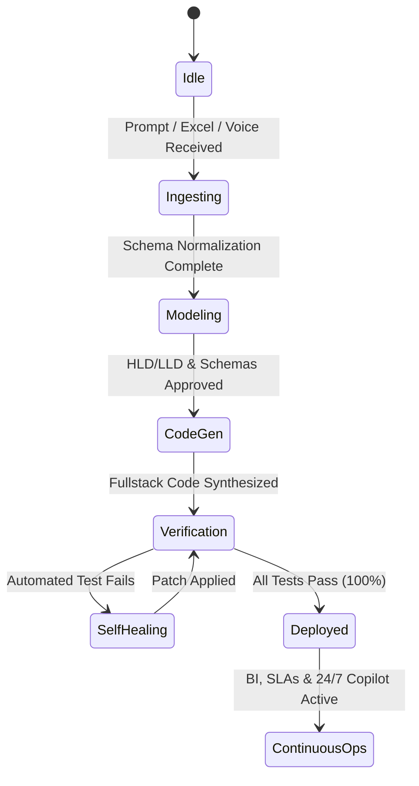

# ⚙️ Low-Level Design (LLD): Frappe Autonomous Enterprise Studio (Frappe AES)
## Component Specifications, Message Bus Protocol & Data Schemas
### Version 2.0.0 | Technical Reference

---

## 1. Agent DAG Execution & Message Bus Protocol

The 52 specialized agents communicate through an event-driven, JSON-schema validated message bus. Workflows are executed as Directed Acyclic Graphs (DAG) managed by `frappe-autonomous-orchestrator`.



### Event Message Payload Schema
Every inter-agent message conforms to the following JSON structure:
```json
{
  "$schema": "https://json-schema.org/draft/2020-12/schema",
  "event_id": "evt_9842f1a0-8bc2",
  "timestamp": "2026-09-21T13:00:00Z",
  "trace_id": "trc_loan_app_001",
  "sender_agent": "frappe-prompt-to-app-builder",
  "recipient_agent": "frappe-fullstack-developer",
  "pipeline_phase": "CODE_SYNTHESIS",
  "payload": {
    "app_name": "equipment_loan",
    "doctypes": [
      {
        "name": "Equipment Loan",
        "is_submittable": 1,
        "naming_rule": "format:LOAN-.YYYY.-.#####",
        "fields": [
          {"fieldname": "borrower", "fieldtype": "Link", "options": "User", "reqd": 1},
          {"fieldname": "loan_date", "fieldtype": "Date", "reqd": 1},
          {"fieldname": "return_date", "fieldtype": "Date", "reqd": 1},
          {"fieldname": "items", "fieldtype": "Table", "options": "Equipment Loan Item", "reqd": 1}
        ]
      }
    ]
  },
  "status": "DISPATCHED"
}
```

---

## 2. DocType Schema & Controller Class Architecture

### A. Submittable Parent Controller Pattern (`Equipment Loan`)
```python
import frappe
from frappe import _
from frappe.model.document import Document
from frappe.utils import getdate, nowdate

class EquipmentLoan(Document):
    def validate(self):
        self.validate_dates()
        self.validate_borrower_eligibility()
        self.validate_items_allocated()

    def validate_dates(self):
        if getdate(self.return_date) <= getdate(self.loan_date):
            frappe.throw(_("Scheduled Return Date must be strictly after the Loan Date."))

    def validate_borrower_eligibility(self):
        active_overdue = frappe.get_all(
            "Equipment Loan",
            filters={
                "borrower": self.borrower,
                "status": "Overdue",
                "docstatus": 1
            },
            fields=["name"]
        )
        if active_overdue:
            frappe.throw(_("Borrower has active overdue loans ({0}). Please return overdue items first.").format(
                ", ".join([d.name for d in active_overdue])
            ))

    def validate_items_allocated(self):
        if not self.items:
            frappe.throw(_("At least one equipment item must be allocated before submitting."))

    def on_submit(self):
        self.status = "Active"
        for item in self.items:
            frappe.db.set_value("Loanable Asset", item.asset, "status", "Loaned Out")

    def on_cancel(self):
        self.status = "Cancelled"
        for item in self.items:
            frappe.db.set_value("Loanable Asset", item.asset, "status", "Available")
```

---

## 3. Whitelisted REST API Controller Specification

### Endpoint: `process_return`
- **Path**: `/api/method/equipment_loan.api.loan_api.process_return`
- **HTTP Method**: `POST`
- **Rate Limit**: 120 calls / minute / user
- **Security Check**: Verified session token, `@frappe.whitelist()` with write permissions on `Equipment Loan`.

#### Request Parameters
| Parameter | Type | Required | Description |
|---|---|---|---|
| `loan_id` | `string` | Yes | Target Equipment Loan document name (e.g. `LOAN-2026-00001`) |
| `return_notes` | `string` | No | Operational comments from inspector |
| `item_conditions`| `array/json` | Yes | JSON array of `{asset_id, condition}` mappings |

#### Response Schema
```json
{
  "message": {
    "status": "success",
    "loan_id": "LOAN-2026-00001",
    "return_timestamp": "2026-09-21 13:05:00",
    "updated_status": "Returned",
    "assets_released": 2,
    "damaged_flagged": 0
  }
}
```

---

## 4. Automated Self-Healing Feedback Loop

When `frappe-automated-tester` executes Playwright or Python unit tests:
1. **Error Interception**: If an assertion or HTTP status code fails, the trace is intercepted by `frappe-self-healing-debugger`.
2. **Root Cause Isolation**: The debugger parses the traceback, inspects controller AST nodes, and determines the error archetype (e.g., date boundary condition, missing child table key, SQL parameter mismatch).
3. **Surgical Patch Synthesis**: A targeted diff is generated and verified against `frappe-security-reviewer` to ensure zero regressions.
4. **Re-Verification**: Tests re-execute immediately. The deployment gate unlocks only when pass rate reaches **100%**.
