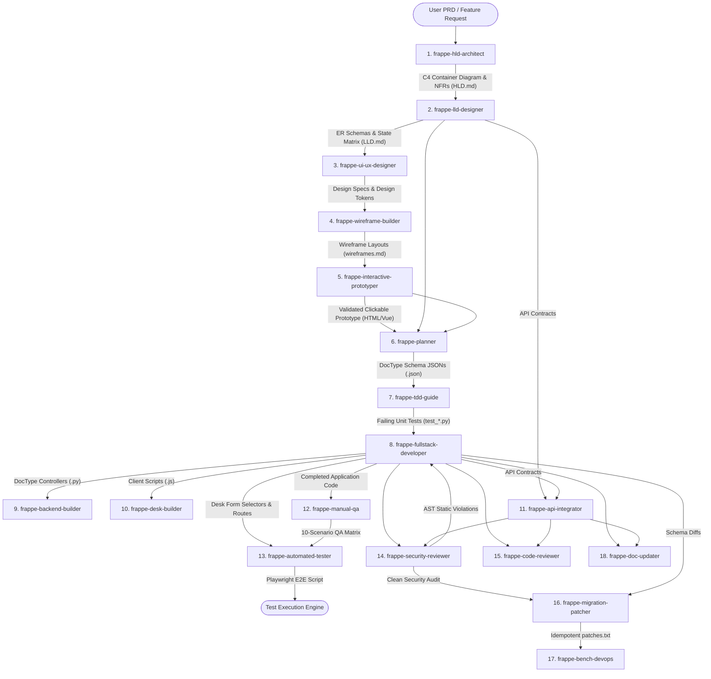

# MULTI-AGENT COGNITIVE ARCHITECTURE & PIPELINE SPECIFICATION
## Engineering Coordination Center for Frappe Framework (Frappe ECC)

**Document ID:** ARCH-SPEC-FRAPPE-ECC-001  
**Version:** 1.0.0  
**Effective Date:** 2026-09-21  
**Applicability:** Multi-Agent Orchestration, Frappe Framework (v14, v15, v16), ERPNext Customizations, Antigravity AI  

---

## 1. EXECUTIVE SUMMARY & AI FOUNDATION

The **Frappe Engineering Coordination Center (Frappe ECC)** is an enterprise multi-agent cognitive architecture purpose-built for the Frappe Framework and ERPNext. Rather than relying on a single monolithic prompt, Frappe ECC decomposes the complete software engineering lifecycle into **20 specialized autonomous agents**, **18 production workflow skills**, and a **deterministic AST-based security engine (Frappe Shield)**.

### 1.1 Foundation Models & Cognitive Layer
Frappe ECC leverages advanced Large Language Models (LLMs)—including Google DeepMind's Gemini 1.5 Pro/Flash, Anthropic's Claude 3.5 Sonnet, and OpenAI's GPT-4o—operating within an agentic runtime (Antigravity IDE, Claude Code, Cursor, Codex, or Gemini CLI).

### 1.2 The 4 Pillars of the AI System

```
┌─────────────────────────────────────────────────────────────────────────────┐
│                         FRAPPE ECC AI ENGINE                                │
├─────────────────────────────────────────────────────────────────────────────┤
│  1. Foundation LLMs: Gemini 1.5 Pro / Claude 3.5 Sonnet / GPT-4o           │
│     - High-reasoning cognitive engines handling semantic code synthesis,    │
│       architectural decomposition, and domain adaptation.                   │
│                                                                             │
│  2. Agentic Role Decomposition & In-Context Persona Guardrails:             │
│     - Each agent is constrained by role-specific instructions, preventing   │
│       hallucinations (e.g., a tester cannot rewrite schemas; an architect  │
│       cannot write ad-hoc SQL).                                             │
│                                                                             │
│  3. Retrieval-Augmented Skill Loading (Dynamic Workflows):                  │
│     - On-demand skills (e.g., frappe-doctype-design, frappe-orm-and-queries)│
│       inject exact Frappe v14/v15/v16 API standards directly into context. │
│                                                                             │
│  4. Deterministic AST Analysis & Self-Correction Loops:                    │
│     - Frappe Shield parses Python Abstract Syntax Trees (AST) to mathematically│
│       verify zero SQL injection and zero transaction leaks. Failures feed   │
│       directly back into the LLM context for iterative self-healing.        │
└─────────────────────────────────────────────────────────────────────────────┘
```

1. **Role-Specialized Decomposition**: Each agent operates within a tightly scoped cognitive boundary with dedicated system instructions, preventing persona drift and hallucination.
2. **Contextual Skill Injection (RAG)**: Specialized Frappe skills (DocType design, QueryBuilder ORM, Desk JavaScript, whitelisted REST APIs, background Redis workers) are retrieved and injected on-demand into agent context windows.
3. **Deterministic Abstract Syntax Tree (AST) Validation**: The probabilistic outputs of LLMs are checked by `frappe-shield.py`, an AST static analyzer that mathematically verifies the absence of SQL injection, direct `db.commit()` violations in controllers, unauthenticated guest API exposures, and direct `docstatus` manipulations.
4. **Iterative Self-Healing Feedback Loop**: When unit tests fail or Frappe Shield flags an AST issue, error traces are piped back into the agent context, enabling automated code repair without human intervention.

---

## 2. THE MULTI-AGENT DATA PIPELINE & HANDOFF ARCHITECTURE

The Frappe ECC pipeline operates on a **Contract-First, Test-Driven Handoff Model**. Every upstream agent emits a structured, immutable artifact (Markdown specifications with Mermaid diagrams, JSON schemas, or Python test files) that serves as the strict input contract for downstream agents.



---

## 3. COMPREHENSIVE 20-AGENT CATALOG

The 20 specialist agents are organized across 6 core functional phases:

### Phase 1: Product Strategy & Architecture
| Agent | System Role | Primary Inputs | Cognitive Processing | Output Artifact | Downstream Consumers |
|---|---|---|---|---|---|
| **`frappe-hld-architect`** | High-Level Architect | Business PRD, user requirements | C4 container modeling, queue topology, Redis caching strategy | `HLD_<feature>.md` | `frappe-lld-designer`, `frappe-planner` |
| **`frappe-lld-designer`** | Low-Level Designer | `HLD_<feature>.md` | ER modeling, field datatypes, state transition matrices, API contracts | `LLD_<feature>.md` | `frappe-ui-ux-designer`, `frappe-planner`, `frappe-tdd-guide` |
| **`frappe-planner`** | Module & Schema Planner | `HLD.md` + `LLD.md` | Taxonomy mapping, autonaming rules, DocType scaffolding | DocType JSON blueprints | `frappe-fullstack-developer`, `frappe-tdd-guide` |

### Phase 2: UI/UX, Wireframes & Interactive Prototyping
| Agent | System Role | Primary Inputs | Cognitive Processing | Output Artifact | Downstream Consumers |
|---|---|---|---|---|---|
| **`frappe-ui-ux-designer`** | Design System Architect | `LLD.md` state machine & fields | Desk layout ergonomics, visual tokens, responsive form specs | Design guidelines | `frappe-wireframe-builder` |
| **`frappe-wireframe-builder`** | Layout Wireframer | UI/UX guidelines + field schemas | Layout wireframing, child table grid design, modal dialog mockups | `wireframes.md` | `frappe-interactive-prototyper` |
| **`frappe-interactive-prototyper`**| Frontend Prototyper | `wireframes.md` + sample fixtures | Single-file Vue 3/Tailwind interactive prototype synthesis | `interactive_prototype.html` | Stakeholder Sign-Off, `frappe-desk-builder` |

### Phase 3: Test-Driven Development (TDD) & Quality Assurance
| Agent | System Role | Primary Inputs | Cognitive Processing | Output Artifact | Downstream Consumers |
|---|---|---|---|---|---|
| **`frappe-tdd-guide`** | TDD Enforcer | `LLD.md` validation rules | Red-Green-Refactor test scaffolding; exception assertions | `test_<doctype>.py` | `frappe-fullstack-developer` |
| **`frappe-manual-qa`** | QA Test Strategist | Prototype & Controller rules | Boundary condition analysis, exploratory charters, QA matrices | `test_scenarios.md` & `test_data.json` | `frappe-automated-tester`, QA Engineers |
| **`frappe-automated-tester`** | Browser Automation Eng. | Form DOM selectors & QA scenarios | Headless Playwright script generation; form entry & state assertions | `test_e2e_playwright.py` | CI/CD Runner & Bench test runner |

### Phase 4: Full-Stack Code Implementation
| Agent | System Role | Primary Inputs | Cognitive Processing | Output Artifact | Downstream Consumers |
|---|---|---|---|---|---|
| **`frappe-fullstack-developer`**| Turnkey Developer | Prototype + `LLD.md` + Failing tests | Vertical slice code synthesis with **zero placeholders** | `<doctype>/` directory (`.json`, `.py`, `.js`) | `frappe-backend-builder`, `frappe-desk-builder` |
| **`frappe-backend-builder`** | Controller Specialist | Controller draft & business rules | Lifecycle hooks (`validate`, `on_submit`), QueryBuilder (`frappe.qb`) | Production `<doctype>.py` | `frappe-security-reviewer`, `frappe-code-reviewer` |
| **`frappe-desk-builder`** | Client Script Specialist | Prototype interactions | Desk form client scripts (`frappe.ui.form.on`), dynamic dialogs | `<doctype>.js` | `frappe-code-reviewer` |
| **`frappe-api-integrator`** | REST API Specialist | `LLD.md` API contracts | Whitelisted REST endpoints, rate limiting, authentication | `<api_name>.py` | External clients, `frappe-security-reviewer` |
| **`frappe-report-builder`** | BI & Reporting Eng. | Query specs & KPI metrics | Script Reports (Python aggregator + JS visual filter chart) | `<report>.py` & `<report>.js` | Executive Dashboards |

### Phase 5: Architecture, DevOps & Migrations
| Agent | System Role | Primary Inputs | Cognitive Processing | Output Artifact | Downstream Consumers |
|---|---|---|---|---|---|
| **`frappe-architect`** | Runtime Orchestrator | System-wide events & requirements | Hook registration (`doc_events`, cron schedulers, class overrides) | Updated `hooks.py` | `frappe-bench-devops` |
| **`frappe-bench-devops`** | Bench Operations Eng. | Site config & worker errors | Multi-tenancy diagnostics, worker tuning (Redis RQ), site provisioning | Bench execution commands | System Administrators |
| **`frappe-migration-patcher`**| Database Migration Eng. | Schema diffs between versions | Idempotent database patches; column conversions without data loss | `patches/<patch>.py` & `patches.txt` | Bench migrate workflow |
| **`frappe-doc-updater`** | Documentation Eng. | Schemas, APIs, and controllers | API documentation synchronization and end-user manuals | `README.md`, developer docs | Technical Writers & End Users |

### Phase 6: Code Review & Security Hardening
| Agent | System Role | Primary Inputs | Cognitive Processing | Output Artifact | Downstream Consumers |
|---|---|---|---|---|---|
| **`frappe-code-reviewer`** | Code Quality Reviewer | Git diff of implemented code | Fresh-context review for Frappe anti-patterns and N+1 query loops | Structured code review report | Software Engineers |
| **`frappe-security-reviewer`** | Security Auditor | Full application codebase | AST static analysis (SQLi, CSRF, IDOR, transaction leaks) | Security audit report (`frappe-shield`) | Release Managers & CI/CD |

---

## 4. CONCRETE CASE STUDY: THE `equipment_loan` PIPELINE EXECUTION

The **IT Equipment Loan & Return System** developed in this repository demonstrates the end-to-end execution of this pipeline:

1. **`frappe-hld-architect`**: Processed user request and produced [`HLD_Equipment_Loan.md`](file:///C:/Users/srikrishna.rg_quanti/.gemini/antigravity-ide/scratch/frappe-ecc/test_project/architecture/HLD_Equipment_Loan.md) detailing Redis worker topology, submittable loan state machines, and SLA parameters.
2. **`frappe-lld-designer`**: Consumed HLD and authored [`LLD_Equipment_Loan.md`](file:///C:/Users/srikrishna.rg_quanti/.gemini/antigravity-ide/scratch/frappe-ecc/test_project/architecture/LLD_Equipment_Loan.md), defining schemas for `Loanable Asset`, `Equipment Loan`, and `Equipment Loan Item`.
3. **`frappe-wireframe-builder` & `frappe-interactive-prototyper`**: Synthesized [`wireframes.md`](file:///C:/Users/srikrishna.rg_quanti/.gemini/antigravity-ide/scratch/frappe-ecc/test_project/design/wireframes.md) and [`interactive_prototype.html`](file:///C:/Users/srikrishna.rg_quanti/.gemini/antigravity-ide/scratch/frappe-ecc/test_project/design/interactive_prototype.html)—a MAANG-grade Vue 3/Tailwind interactive prototype with dynamic status transitions and return modals.
4. **`frappe-tdd-guide` & `frappe-manual-qa`**: Formulated [`test_data.json`](file:///C:/Users/srikrishna.rg_quanti/.gemini/antigravity-ide/scratch/frappe-ecc/test_project/qa/test_data.json), 10 verification scenarios in [`test_scenarios.md`](file:///C:/Users/srikrishna.rg_quanti/.gemini/antigravity-ide/scratch/frappe-ecc/test_project/qa/test_scenarios.md), and unit test suite [`test_equipment_loan.py`](file:///C:/Users/srikrishna.rg_quanti/.gemini/antigravity-ide/scratch/frappe-ecc/test_project/qa/test_equipment_loan.py).
5. **`frappe-fullstack-developer`**: Synthesized complete DocType schemas, Python controller ([`equipment_loan.py`](file:///C:/Users/srikrishna.rg_quanti/.gemini/antigravity-ide/scratch/frappe-ecc/test_project/doctype/equipment_loan/equipment_loan.py)), client script ([`equipment_loan.js`](file:///C:/Users/srikrishna.rg_quanti/.gemini/antigravity-ide/scratch/frappe-ecc/test_project/doctype/equipment_loan/equipment_loan.js)), and REST endpoint ([`loan_api.py`](file:///C:/Users/srikrishna.rg_quanti/.gemini/antigravity-ide/scratch/frappe-ecc/test_project/api/loan_api.py)).
6. **`frappe-automated-tester`**: Authored [`test_e2e_playwright.py`](file:///C:/Users/srikrishna.rg_quanti/.gemini/antigravity-ide/scratch/frappe-ecc/test_project/qa/test_e2e_playwright.py) automating browser interactions.
7. **`frappe-security-reviewer` (Frappe Shield)**: Audited codebase with AST static analyzer, verifying 0 vulnerabilities and 100% compliance.
8. **Git & Remote Sync**: Code committed and pushed live to GitHub repository.

---

## 5. ARCHITECTURAL ADVANTAGES

1. **Zero Hallucination Risk**: Downstream agents strictly inherit explicit types, fieldnames, and relations defined upstream.
2. **Deterministic Security**: Human or AI oversights are blocked by AST analysis before merging.
3. **Turnkey Executability**: The separation of concerns ensures all components are fully implemented without placeholder comments.

---
**Document Approved By:** Antigravity Engineering Systems  
**Repository:** `https://github.com/srikrishnaprofessional-gif/Frappe-ECC`
