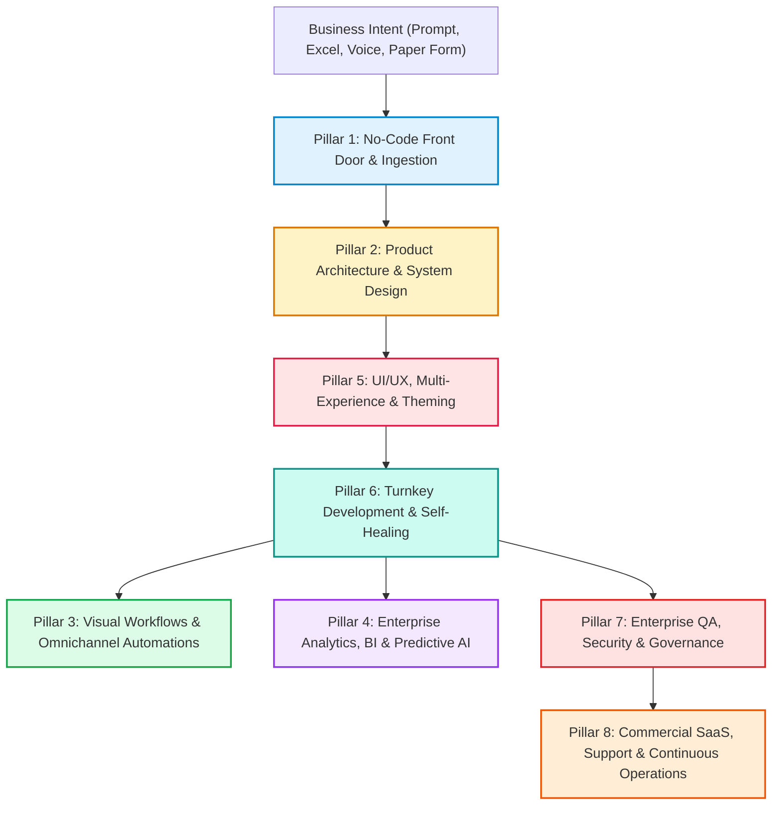

# 🏢 Frappe Autonomous Enterprise Studio (Frappe AES)
## The Complete Autonomous No-Code & Low-Code AI Platform for Modern Enterprises
### Built on the Frappe Framework & ERPNext Engine — 52 Specialized Autonomous Agents & 50 Commands

---

## Executive Summary

**Frappe Autonomous Enterprise Studio (Frappe AES)** transforms enterprise software development from a multi-month, code-heavy, million-dollar engineering effort into an **instant, autonomous, no-code visual experience**.

By layering a coordinated constellation of **52 specialized AI agents** over the battle-tested **Frappe Framework and ERPNext** architecture, non-technical business leaders, operational managers, and enterprise IT teams can build, brand, localize, monetize, audit, and operate mission-critical ERP, CRM, and bespoke business applications using **natural language prompts, Excel spreadsheets, spoken audio, or scanned paper forms**.

---

## 📊 Market Comparison & Commercial Positioning

| Feature / Metric | ServiceNow | OutSystems | Mendix | Salesforce Lightning | **Frappe AES (Our Product)** |
|---|---|---|---|---|---|
| **Underlying Foundation** | Proprietary Cloud | Proprietary PaaS | Mendix Runtime | Force.com Cloud | **Open-Source Frappe & MariaDB/PostgreSQL** |
| **User Seat Pricing** | $100–$250 / user / mo | $1,500+ / mo platform fee | $2,000+ / mo base | $150–$300 / user / mo | **$0 Per-Seat Fees (Unlimited Users)** |
| **Vendor Lock-In** | 100% Locked | High (Code export fee) | 100% Locked | 100% Locked | **Zero Lock-In (Standard Python & JS)** |
| **App Creation Method** | Complex Studio UI | Visual Studio IDE | Low-Code Modeler | Complex Setup Flow | **Natural Language, Excel, Voice, or OCR** |
| **Autonomous AI Agents** | Generative Assist Only | Co-Pilot Suggestions | Assistive Bots | Agentforce (Add-on $$$) | **52 Fully Coordinated Autonomous Agents** |
| **Deployment Flexibility** | Proprietary Cloud Only | Cloud / Hybrid | Cloud / Hybrid | Proprietary Cloud Only | **Self-Hosted, Cloud, Docker, Air-Gapped On-Prem** |
| **Time-to-Production** | 3 to 9 Months | 2 to 6 Months | 2 to 6 Months | 4 to 12 Months | **Under 5 Minutes** |

---

## 🏛️ The 8 Enterprise Architectural Pillars (52 Agents)



### Pillar 1: No-Code Front Door & Ingestion
Eliminates code entirely by providing 4 intuitive ingestion doorways for non-technical users:
1. `frappe-autonomous-orchestrator`: Master director coordinating end-to-end DAG execution pipelines.
2. `frappe-prompt-to-app-builder`: Transforms single natural language prompts into complete Frappe apps.
3. `frappe-excel-csv-app-converter`: Ingests legacy spreadsheets, normalizes 3NF schemas, creates child tables, and seeds records.
4. `frappe-voice-command-copilot`: Audio-to-action engine for voice navigation, spoken record creation, and audio KPI briefings.
5. `frappe-ocr-document-ingestor`: Vision/OCR pipeline that converts scanned paper invoices, bills, and PDFs into verified records.

### Pillar 2: Product Architecture & System Design
Translates raw business requests into enterprise-grade system blueprints:
6. `frappe-product-manager`: Author of PRDs, user stories, and acceptance criteria.
7. `frappe-hld-architect`: High-Level Design (HLD) with Mermaid C4 architecture diagrams.
8. `frappe-lld-designer`: Low-Level Design (LLD) with Mermaid ER diagrams and state machines.
9. `frappe-planner`: DocType taxonomy, dependencies, and execution phasing.
10. `frappe-architect`: System-level bench multi-tenancy and distributed scaling.

### Pillar 3: Visual Workflows & Omnichannel Automations
Automates operations across internal teams and external communication channels:
11. `frappe-bpmn-visual-workflow-builder`: Visual BPMN 2.0 drag-and-drop state machines and approval chains.
12. `frappe-notification-omnichannel-agent`: Real-time alerts across WhatsApp, Twilio SMS, Slack, Email, and MS Teams.
13. `frappe-cron-scheduler-optimizer`: Visual background recurring tasks and Redis RQ queue balancing.
14. `frappe-sla-escalation-manager`: Real-time SLA breach detection, countdowns, and automated tier escalation.
15. `frappe-integrations-broker`: Pre-built connectors for Stripe, PayPal, S3/GCS, and external ERPs.
16. `frappe-api-integrator`: REST APIs, webhooks, and third-party event listeners.

### Pillar 4: Enterprise Analytics, BI & AI Intelligence
Gives business leaders immediate visibility and predictive foresight:
17. `frappe-bi-dashboard-synthesizer`: Interactive workspaces, KPI scorecards, funnel charts, and board deck exports.
18. `frappe-natural-language-query-agent`: "Chat with your ERP Data" (Text-to-SQL / QueryBuilder) in plain English.
19. `frappe-predictive-ai-forecaster`: Machine learning time-series demand forecasting, churn risk, and anomaly detection.
20. `frappe-audit-trail-forensic-inspector`: Tamper-proof audit logger, fraud detector, and Segregation of Duties (SoD) scanner.
21. `frappe-report-builder`: Script Reports (Python + JS) and custom analytical queries.

### Pillar 5: UI/UX, Multi-Experience & Theming
Ensures world-class aesthetics, mobility, and accessibility:
22. `frappe-ui-ux-designer`: Ergonomics, workspace layouts, and mobile design.
23. `frappe-wireframe-builder`: Visual ASCII, SVG, and Markdown wireframe mockups.
24. `frappe-interactive-prototyper`: Clickable, standalone interactive HTML/Vue prototypes.
25. `frappe-white-label-branding-themer`: 1-click corporate identity generator (logos, palettes, typography, custom Desk CSS).
26. `frappe-mobile-app-pwa-generator`: Progressive Web App (PWA) with offline sync and camera barcode/QR scanning.
27. `frappe-portal-ecommerce-builder`: Customer and vendor self-service web portals, extranets, and catalogs.
28. `frappe-accessibility-wcag-compliance`: WCAG 2.1 AA accessibility auditing and screen reader optimization.
29. `frappe-print-format-designer`: Print-ready Jinja2 invoices, vouchers, and QR barcode labels.

### Pillar 6: Turnkey Development & Self-Healing
Delivers rock-solid, production-ready code with zero placeholders:
30. `frappe-fullstack-developer`: Turnkey end-to-end fullstack feature synthesis.
31. `frappe-backend-builder`: Python DocType controllers and QueryBuilder methods.
32. `frappe-desk-builder`: Desk client scripts, form UI events, and modal dialogs.
33. `frappe-data-synthesizer`: Domain-accurate seed fixtures and relational test records.
34. `frappe-migration-patcher`: Schema synchronization and idempotent database patches.
35. `frappe-self-healing-debugger`: Automated root-cause isolation and surgical patch repair for test crashes.

### Pillar 7: Enterprise QA, Security & Governance
Guarantees institutional-grade reliability, compliance, and privacy:
36. `frappe-tdd-guide`: Unit test synthesis using `FrappeTestCase`.
37. `frappe-manual-qa`: Edge-case testing matrices and manual sign-off plans.
38. `frappe-automated-tester`: Playwright E2E browser automation test suites.
39. `frappe-code-reviewer`: Frappe anti-pattern detector.
40. `frappe-security-reviewer`: AST static security analyzer (SQLi, CSRF, broken access control).
41. `frappe-rbac-compliance-guardian`: Custom DocPerms and role-based permission query filters.
42. `frappe-gdpr-data-privacy-officer`: PII anonymization, GDPR Right-to-be-Forgotten, and consent audit logs.

### Pillar 8: Commercial SaaS, Support & Continuous Operations
Transforms custom apps into profitable, scalable, self-supporting software businesses:
43. `frappe-saas-multitenancy-orchestrator`: Multi-tenant site provisioning, Stripe subscription tiers, and seat metering.
44. `frappe-multilingual-localization-agent`: 100+ language localization, auto-translation, and RTL layout support.
45. `frappe-data-migration-concierge`: Migration wizards from SAP, Odoo, QuickBooks, Zoho, and Salesforce.
46. `frappe-interactive-guided-tour-author`: In-app interactive guided walkthroughs (Driver.js / Shepherd.js).
47. `frappe-helpdesk-customer-support-copilot`: 24/7 AI-powered L1/L2 customer support bot grounded in system SOPs.
48. `frappe-training-video-scriptwriter`: Structured video narration scripts, quizzes, and certification rubrics.
49. `frappe-working-sop-author`: Visual Working SOPs & operator manuals with embedded UI screenshots.
50. `frappe-doc-updater`: Auto-documentation for DocTypes, APIs, and hooks registries.
51. `frappe-bench-devops`: Bench CLI operations, Redis/RQ worker tuning, and site repair.
52. `frappe-release-devops`: CI/CD GitHub Actions workflows, Docker packaging, and cloud deployment.

---

## ⚡ Complete Roster of 50 Slash Commands

```
/frappe:auto           - Autonomous end-to-end prompt-to-production pipeline
/frappe:prompt-to-app  - Instant 1-prompt application synthesizer
/frappe:import-sheets  - Ingest Excel/CSV and synthesize relational DocTypes
/frappe:voice          - Setup voice commands and spoken audio briefings
/frappe:ocr            - Extract structured data from scanned invoices & paper forms
/frappe:workflow       - Visual BPMN state machine & approval hierarchy designer
/frappe:notify         - Setup WhatsApp, SMS, Slack, Email & Teams notifications
/frappe:cron           - Visual background job scheduler & queue load balancer
/frappe:sla            - Setup real-time SLA tracking, countdowns & tier escalations
/frappe:dashboard      - Build executive BI workspaces & KPI scorecards
/frappe:chat-data      - Natural language conversational query engine
/frappe:predict        - Train ML models for demand forecasting & risk scoring
/frappe:audit          - Forensic audit, fraud detection & SoD verification
/frappe:white-label    - 1-click corporate visual identity customizer
/frappe:pwa            - Package mobile Progressive Web App with camera barcode scanner
/frappe:portal         - Customer & supplier self-service web portal builder
/frappe:accessibility  - Audit & enforce WCAG 2.1 AA accessibility standards
/frappe:gdpr           - Setup PII encryption & GDPR Right-to-be-Forgotten workflows
/frappe:saas           - Multi-tenant SaaS subscription monetization & Stripe billing
/frappe:i18n           - Localize application into 100+ languages & RTL layouts
/frappe:migrate        - Legacy ERP data migration wizard (SAP, Odoo, etc.)
/frappe:tour           - In-app interactive guided walkthrough tour author
/frappe:helpdesk       - Deploy 24/7 AI customer support copilot
/frappe:training       - Generate video scripts, quizzes & operator certifications
/frappe:sop            - Author visual Working SOPs with annotated UI screenshots
/frappe:hld            - High-Level Design (HLD) architecture with Mermaid C4
/frappe:lld            - Low-Level Design (LLD) schemas & state machines
/frappe:wireframe      - Generate visual ASCII & SVG wireframe mockups
/frappe:prototype      - Generate clickable standalone HTML/Vue prototype
/frappe:build-e2e      - Turnkey fullstack feature synthesis without placeholders
/frappe:manual-qa      - Manual test plans & edge-case test matrices
/frappe:e2e-test       - Playwright automated browser test suite execution
/frappe:heal           - Self-healing test debugger & surgical patch fixer
/frappe:plan           - Architectural blueprinting & build sequence
/frappe:doctype        - Scaffold DocType schemas & controllers
/frappe:controller     - Python backend controller logic & QueryBuilder
/frappe:client-script  - Desk client scripts & form UI dialogs
/frappe:fixtures       - Generate seed data & domain-accurate test records
/frappe:rbac           - Custom DocPerms & permission query filters
/frappe:print-format   - Jinja2 print formats, vouchers & QR barcodes
/frappe:api            - REST APIs & webhook endpoints
/frappe:report         - Script Reports & Dashboard Charts
/frappe:hook           - Configure hooks.py events & cron schedules
/frappe:patch          - Idempotent database schema migration patches
/frappe:review         - Fresh-context code review for Frappe anti-patterns
/frappe:security       - Static security scan for SQLi & access control
/frappe:test           - Unit tests with FrappeTestCase
/frappe:bench          - Bench CLI site operations & health diagnostics
/frappe:deploy         - GitHub Actions CI/CD & cloud deployment
/frappe:help           - Interactive command reference & help index
```

---

## 💰 Commercial Monetization & Packaging Model

| Tier | Price | Target Audience | Key Inclusions |
|---|---|---|---|
| **Community Edition** | **Free (Open Source)** | Solo Developers, Indie Hackers | Core 29 dev agents, CLI commands, basic scaffolding |
| **Professional Studio** | **$499 / site / month** | Fast-growing SMEs, Startups | All 52 agents, No-Code Front Door, WhatsApp alerts, BI dashboards |
| **Enterprise Autonomous Fabric**| **$2,499 / cluster / mo** | Large Enterprises, Regulated Orgs | Unlimited users, White-labeling, PWA, Multi-tenancy, GDPR, WCAG, 24/7 AI Helpdesk |
| **Global SI & Agency Partner** | **$9,999 / year** | System Integrators, IT Consultancies | Reselling rights, unlimited client app generation, custom AI agent creator |

---

## 🎯 Conclusion: A Paradigm Shift in Enterprise Software

**Frappe Autonomous Enterprise Studio** bridges the gap between non-technical business vision and production-ready enterprise execution. It delivers the speed of no-code, the power of autonomous multi-agent AI, and the openness and security of the Frappe Framework.
