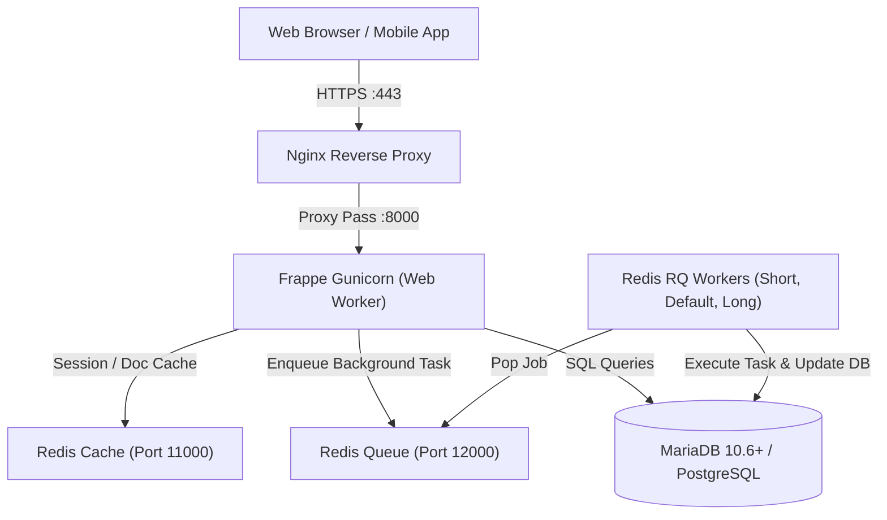
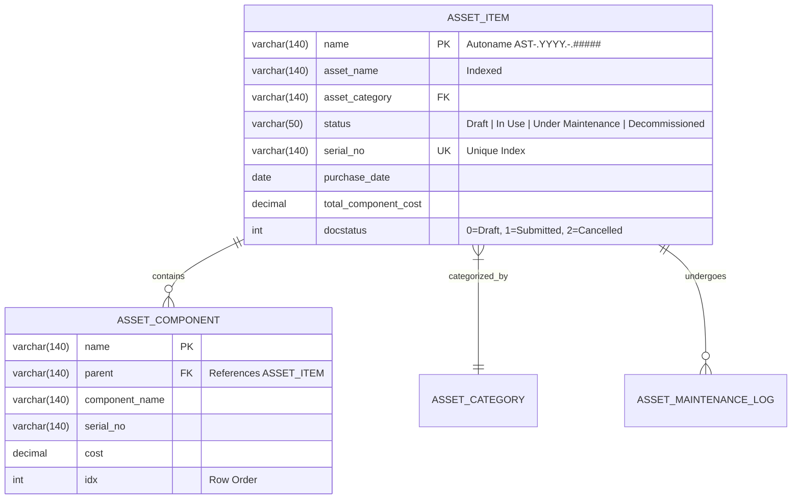

# Frappe HLD & LLD System Design Mastery

## 1. High-Level Design (HLD) Workflow
HLD articulates the macro architecture, component boundaries, and non-functional requirements.

### C4 Container Architecture Template

---

## 2. Low-Level Design (LLD) Workflow
LLD provides precise technical specifications: entity relationships, class hierarchies, method signatures, and state machines.

### Entity-Relationship (ER) Modeling Template

### State Machine Lifecycle
| Current State | Trigger / Action | Conditions | Next State | Side Effects |
|---|---|---|---|---|
| `Draft` (`docstatus=0`) | Click `Submit` | All required fields present; components > 0 | `Submitted` (`docstatus=1`) | Status set to `In Use`; post asset ledger entry |
| `In Use` (`docstatus=1`) | Click `Schedule Maintenance` | No active maintenance tickets | `Under Maintenance` | Send notification to IT technician |
| `Under Maintenance` | Click `Resolve Maintenance` | Resolution notes present | `In Use` | Update maintenance history log |
| `Submitted` (`docstatus=1`) | Click `Cancel` | Reason provided; no active dependencies | `Cancelled` (`docstatus=2`) | Reverse asset allocations |
