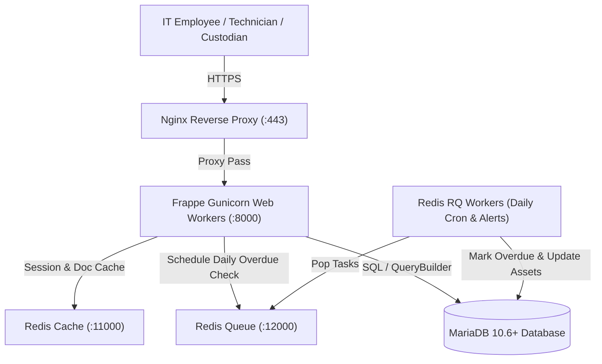

# High-Level Design (HLD): IT Equipment Loan & Return System
**Author:** frappe-hld-architect  
**System:** `equipment_loan` (Frappe Framework v15/v16)  
**Status:** Approved for Implementation  

---

## 1. Executive Summary & Objectives
The **IT Equipment Loan & Return System** provides centralized governance over enterprise hardware lending (laptops, monitors, testing phones, peripherals). It automates borrower eligibility validation, inventory tracking, handover sign-off, return condition logging, and overdue alerting.

---

## 2. System Architecture (C4 Container Diagram)

---

## 3. Component Breakdown & Boundaries
1. **Loanable Asset Catalog (`Loanable Asset`)**: Master inventory records tracking serial number, model, replacement value, and availability status (`Available`, `Loaned Out`, `Maintenance`).
2. **Equipment Loan Document (`Equipment Loan`)**: Submittable transactional record capturing borrower, handover date, expected return date, and embedded borrowed items.
3. **Child Grid (`Equipment Loan Item`)**: Details specific hardware items allocated, serial numbers, and condition ratings.
4. **Return Processing API**: Secure whitelisted REST API (`/api/method/equipment_loan.api.loan_api.process_return`) handling return condition assessments.
5. **Overdue Background Worker**: Daily cron job inspecting active loans exceeding return date and flagging them as `Overdue`.

---

## 4. Non-Functional Requirements (NFRs)
- **Concurrency & Locking**: Asset availability is locked upon loan submission to prevent double-lending.
- **Auditability**: Complete audit trail via Frappe document versioning and activity timeline.
- **Performance**: Sub-100ms response time for availability queries utilizing indexed serial numbers.
- **Security**: Strict role-based permissions (`IT Asset Manager`, `Asset Custodian`, `Employee`).
