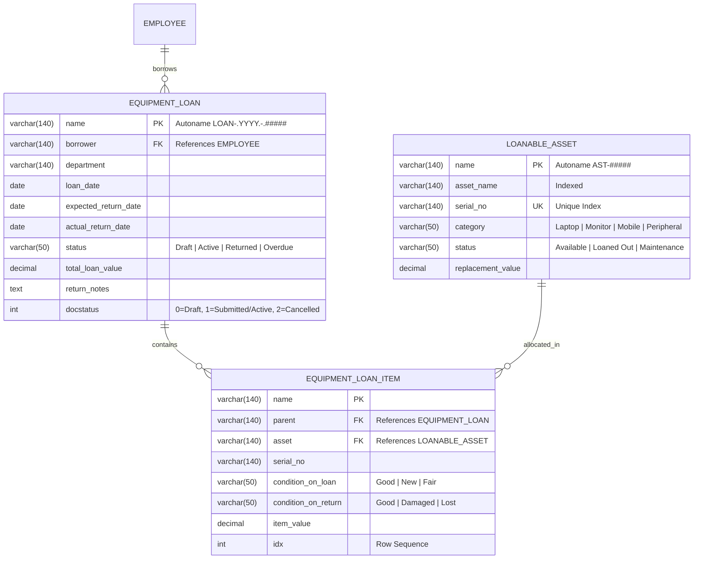

# Low-Level Design (LLD): IT Equipment Loan & Return System
**Author:** frappe-lld-designer  
**System:** `equipment_loan`  
**Status:** Approved for Implementation  

---

## 1. Entity-Relationship (ER) Model



---

## 2. State Transition Machine

```
[Draft: docstatus=0]
        │
        ▼ (Submit action: Validate dates, check availability, borrower check)
[Active / Loaned: docstatus=1]
        │
        ├─────────────────────────────┬─────────────────────────────┐
        │                             │                             │
        ▼ (Process Return API)        ▼ (Daily Cron Check)          ▼ (Cancel action)
[Returned: docstatus=1]       [Overdue: docstatus=1]        [Cancelled: docstatus=2]
(Assets marked Available)      (Alert sent to manager)       (Assets marked Available)
```

---

## 3. Whitelisted REST API Specifications

### Endpoint: `process_return`
- **Route**: `POST /api/method/equipment_loan.api.loan_api.process_return`
- **Headers**: `Authorization: token <key>:<secret>`
- **Request Body**:
  ```json
  {
    "loan_id": "LOAN-2026-00012",
    "return_notes": "All items returned in pristine condition.",
    "item_conditions": {
      "AST-0001": "Good",
      "AST-0002": "Good"
    }
  }
  ```
- **Response**:
  ```json
  {
    "status": "success",
    "loan_id": "LOAN-2026-00012",
    "returned_on": "2026-09-21",
    "items_processed": 2
  }
  ```
