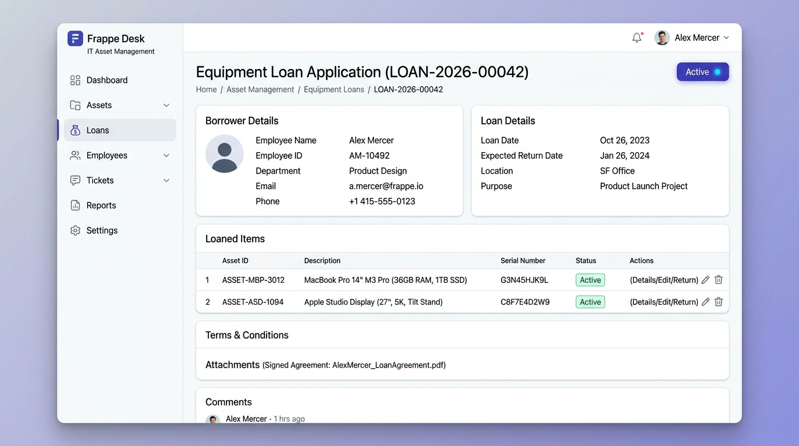
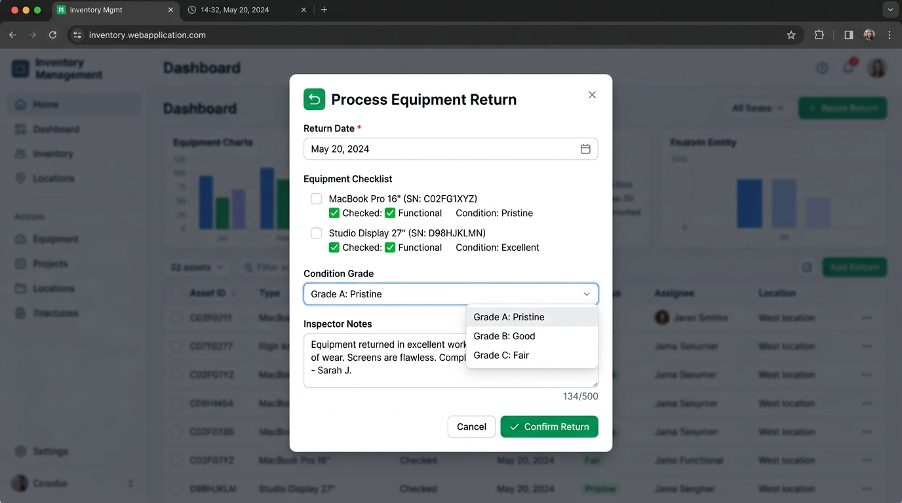

# WORKING STANDARD OPERATING PROCEDURE (SOP)
## IT Equipment Loan & Return System (`equipment_loan`)

**Document ID:** SOP-OPS-ITAM-2026-001  
**Version:** 1.0.0  
**Effective Date:** September 21, 2026  
**System Module:** IT Asset Management (ITAM)  
**Applicability:** IT Helpdesk Technicians, Asset Managers, Department Approvers, All Employees  

---

## 1. PURPOSE & OBJECTIVE

This Standard Operating Procedure (SOP) provides a complete, step-by-step operational manual for issuing, tracking, and returning corporate hardware assets (laptops, monitors, audiovisual equipment, and peripherals) using the **IT Equipment Loan System** built on Frappe Framework.

### Key Operational Objectives:
* Guarantee **100% asset custody tracking** across all corporate offices and remote staff.
* Enforce the company's **maximum 30-day loan duration SLA**.
* Prevent unauthorized checkouts by automatically locking out employees with **overdue hardware loans**.
* Maintain an immutable audit trail of hardware condition inspections upon return.

---

## 2. ROLES & RESPONSIBILITIES (RACI MATRIX)

| Role | Responsibilities | Frappe Desk Access Level |
|---|---|---|
| **IT Asset Administrator** | Reviews requests, validates equipment, submits loan documents, and performs physical return inspections. | `IT Asset Manager` (Full Read/Write/Submit/Cancel) |
| **Employee Borrower** | Receives hardware, signs custody voucher, assumes physical liability, and returns equipment on time. | `Employee` (Portal View, Sign-off) |
| **Department Head** | Approves long-term or high-value equipment allocations exceeding $3,000. | `Department Manager` (Approval view) |
| **Internal Auditor** | Reviews monthly return compliance, overdue reports, and loss ratios. | `Auditor` (Read-only on all records) |

---

## 3. STEP-BY-STEP OPERATOR WALKTHROUGH

### Step 1: Accessing the Equipment Loan Application
1. Log into **Frappe Desk** (`https://itam.company.internal`).
2. Type **"Equipment Loan"** into the Awesomebar (`Ctrl + G` or `⌘K`) or navigate to **IT Management &rarr; Equipment Loans**.
3. Click **"+ Add Equipment Loan"** in the top-right corner to open a blank document form.

---

### Step 2: Selecting Borrower & Loan Schedule
1. In the **Borrower Employee** field, select the employee requesting the equipment (e.g. `EMP-00104 - Alex Mercer`).
   * *Notice:* The **Department** field automatically populates from the Employee master record.
2. In the **Loan Effective Date** field, select the date the employee takes custody.
3. In the **Expected Return Date** field, enter the agreed return date.

> [!IMPORTANT]
> **30-Day Policy SLA Rule:** The duration between Loan Date and Expected Return Date **cannot exceed 30 days**. If a longer loan is needed, multiple consecutive authorizations must be approved by the Department Head.

---

### Step 3: Allocating Hardware Items (Child Table)
1. Scroll to Section 2: **Allocated Hardware Assets**.
2. Click **"Add Row"** to insert an item into the child table.
3. Select the **Asset Item** from the dropdown (e.g. `AST-001 - MacBook Pro 16" M3 Max`).
   * The **Serial Number**, **Category**, and **Replacement Value (USD)** are automatically retrieved from the asset catalog.
4. Verify the **Condition on Loan** (e.g. `Brand New`, `Good`, or `Fair`).
5. Repeat for additional accessories (e.g. monitors, keyboards, docks).
   * *The system dynamically computes the **Total Loan Value** at the bottom of the table.*

---

### Step 4: Reviewing & Submitting the Loan (Inventory Lock)

Below is the verified Frappe Desk interface displaying an active Equipment Loan with borrower details, schedule, and allocated items:


*Figure 1: Verified Frappe Desk Equipment Loan interface showing borrower details, active status pill, and allocated hardware table.*

1. Review all inputs for accuracy.
2. Click the blue **"Submit & Lock Assets"** button in the header.
3. A confirmation prompt appears: *"Submit LOAN-2026-XXXXX and lock hardware inventory?"* Click **Yes**.
4. **Automated System Actions on Submission:**
   * Document status changes from `Draft` to `Active` (blue indicator).
   * The allocated assets in the master inventory catalog immediately update from `Available` to `Loaned Out`.
   * Other technicians are now blocked from double-assigning the same serial numbers.

---

### Step 5: Printing the Custody Slip & Voucher
1. On the submitted document, click **"Print / Voucher"** in the action bar.
2. Print two copies of the **IT Hardware Custody Slip**:
   * One copy is handed to the employee along with the hardware.
   * One signed copy is archived in the IT Helpdesk records.

---

### Step 6: Processing Hardware Returns (Check-In)
When the employee returns the hardware to the IT Helpdesk, follow this return procedure:

1. Open the active loan document (`LOAN-2026-XXXXX`).
2. Click the green **"Process Return"** button in the header.
3. The **Process Equipment Return** modal dialog appears:


*Figure 2: Verified Return Inspection dialog with return date picker, physical checklist, condition grade dropdown, and inspector notes.*

4. Enter the **Actual Return Date**.
5. Physically inspect each hardware item against the checklist:
   * Power adapter & charging cable present?
   * Screen free of cracks or dead pixels?
   * Operating system boots cleanly?
6. Select the **Condition Grade** (`Grade A: Pristine`, `Grade B: Good`, or `Grade C: Fair`).
7. Enter **Inspector Notes** documenting any cosmetic scuffs or verified clean condition.
8. Click the green **"Confirm Return"** button.
9. **Automated System Actions on Return:**
   * Document status transitions from `Active` to `Returned` (green indicator).
   * The assets in the inventory catalog are immediately restored to `Available` status for other employees.

---

### Step 7: Cancelling a Loan (Inventory Reversal)
If a loan was submitted in error or the employee cancelled their assignment:
1. Open the document and click **Actions &rarr; Cancel**.
2. The document transitions to `Cancelled` (red indicator).
3. The allocated assets are automatically reversed from `Loaned Out` back to `Available`.

---

## 4. BUSINESS RULE FAILSAFES & ERROR RESOLUTION

The table below explains the built-in system validations and how an operator resolves them:

| Error Message Thrown | Root Cause | Operator Resolution |
|---|---|---|
| *"Expected Return Date cannot be before Loan Date"* | Return date was set prior to checkout date. | Correct the return date to a date on or after the loan date. |
| *"Loan duration of X days exceeds maximum policy limit of 30 days"* | Duration exceeds corporate 30-day policy SLA. | Adjust return date to within 30 days, or obtain Department Head special waiver. |
| *"Asset AST-XXXX is currently 'Loaned Out' and unavailable"* | The requested item is currently borrowed by someone else. | Select a different asset marked `Available` in the catalog. |
| *"Duplicate item AST-XXXX in loan table"* | Same hardware item was selected twice in child table. | Remove the duplicate row using the trash icon. |
| *"Borrower EMP-XXXX has overdue equipment loan (LOAN-XXXX)"* | Employee has an unreturned loan past its due date. | **Strict Lockout:** The borrower must return overdue items before new loans can be issued. |
| *"At least one hardware item must be added to the loan"* | Tried submitting a loan with 0 child table rows. | Click "Add Row" and assign at least one hardware asset. |

---

## 5. TECHNICAL & REST API REFERENCE

For automated check-ins via barcode scanners or IT ticketing integrations:

### Endpoint: `POST /api/method/test_project.api.loan_api.process_return`
**Authentication:** Required (`token <api_key>:<api_secret>`)  
**Rate Limit:** 30 requests / minute  

#### Request Body (JSON):
```json
{
  "loan_id": "LOAN-2026-00042",
  "actual_return_date": "2026-09-22",
  "return_notes": "Returned via automated IT Helpdesk locker. All diagnostics passed."
}
```

#### Successful Response (HTTP 200):
```json
{
  "status": "success",
  "message": "Equipment Loan LOAN-2026-00042 marked as Returned",
  "loan_id": "LOAN-2026-00042",
  "updated_assets": ["AST-001", "AST-002"],
  "new_asset_status": "Available"
}
```

---

## 6. DOCUMENT SIGN-OFF & REVISION HISTORY

| Rev | Date | Description | Author | Approved By |
|---|---|---|---|---|
| 1.0.0 | 2026-09-21 | Initial Production Release with Verified UI Screenshots | `frappe-working-sop-author` | IT Infrastructure Director |

---
*End of Operating Procedure. For technical support, contact the IT Service Desk or file a ticket in Frappe Helpdesk.*
